# TEAM 여기어째

## -합리적인 집을 구하기 위한 웹사이트-

# 👨‍👩‍👧‍👦 Team

## 황동윤, 강륜화, 박진우, 김유진

2020.08.14 ~ 2020.09.03   삼성 멀티캠퍼스 - 웹 인터페이스 프로젝트

[https://github.com/Multicampus-Cloud-MSA-safehome](https://github.com/Multicampus-Cloud-MSA-safehome)

---

# 📖 Abstract

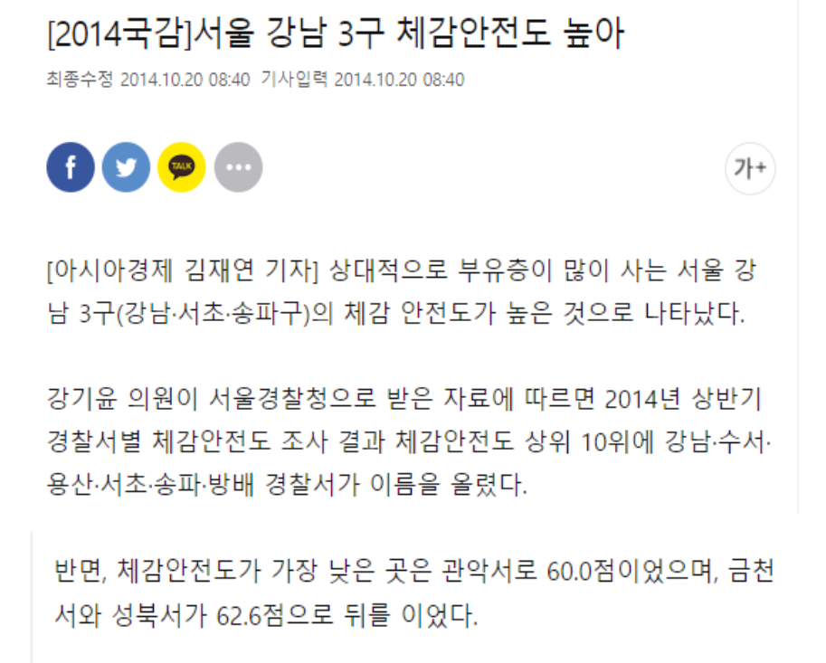

서울시의 집 가격은 계속 상승하고 있습니다.

많은 사람들이 부유한 동네일수록 다양한 위험요소들로부터 안전하다고 느낍니다.

하지만 우리는 집 가격이 생활 안전도를 반영하지는 않으며, 많은 사람들의 예상과 편견은 실제 결과와 다를 수 있다고 생각합니다.

이를 검증하기 위해 국가에서 제공하는 재난/범죄 등 우리 실생활에 영향을 끼치는 위험요소 관련 공공데이터를 기반으로 데이터베이스를 구축했습니다. 많은 사람들이 더 쉽게 통계자료를 이해할 수 있게끔 데이터 셋을 지도, 그래프, 레이더 등을 이용해 시각화했습니다. 또한, 보다 실질적인 정보를 원하는 사람들을 위해 서울시 부동산, 범죄, 홍수 피해 등의 뉴스 기사를 크롤링하여 보여주어 함께 확인할 수 있도록 했습니다.

웹사이트 '여기어째'는 생활 안전과 관련된 정보를 집 가격과 함께 제공하여 시민들이 보다 합리적인 판단을 할 수 있도록 도울 것 입니다. 

---

# 👐 Role

## 황동윤 (팀장)

- `React Framework`를 이용한 front-end 개발
    - `Material-UI React UI framework`를 이용한 전체적인 UI 구성 및 시각화
    - `SVG`를 이용한 서울시 지도 시각화
    - `Chart.js library(react-chartjs-2)` 를 이용한 시각화
- `gh-pages`에 deploy

## 강륜화

- Database Administration
    - `mariaDB, SQLite3`을 이용한 데이터베이스 설계 및 정규화
    - `Django ORM` 을 사용하여 DB CRUD
    - `heroku`와의 연동을 위해 `postgresDB` setting
- Django model instance 생성, serialization

## 김유진

- `django rest framework`를 이용한 API서버 구축
- naver news 크롤링 및 DB에 저장
    - `Beautifulsoup`, `requests` 를 이용하여 파싱하여 제목,링크, 내용을 저장
    - `APScheduler`를 이용하여 일정시간마다 뉴스 업데이트
- `heroku`에 DRF deploy
    - `postgresDB`를 사용하여 데이터베이스 관리

## 박진우

- 공공데이터 수집 및 DB에 저장
- `Pandas`를 이용한 데이터 전처리
- PPT 제작

---

# 🚗 Process

## 1. 프로젝트 기획

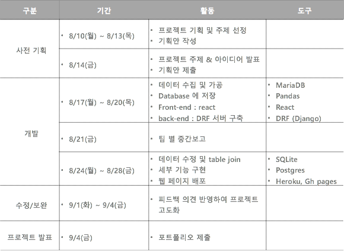

## 2. 세부 진행 간트표

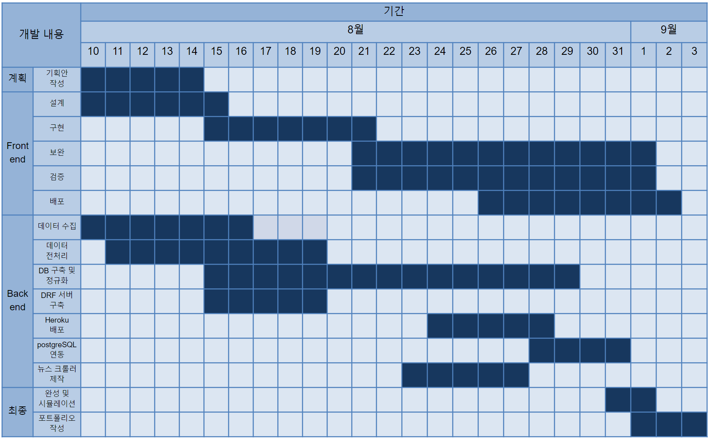

---

# 🌏 구현

# 1. Front-end

# React Framework


## 1) 반응형 CSS와 Material UI로 구현

- Device에 반응하여 UI를 제공하는 Web Application
- Mobile로 접속해도 나쁘지 않은 UI 제공

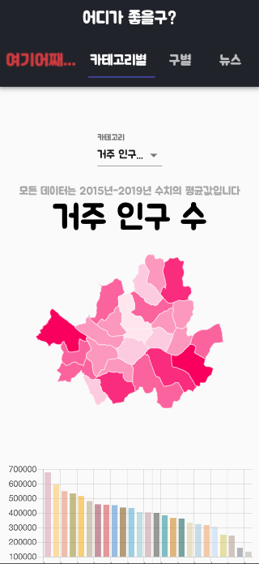

                                                    **<iPhone X in Chrome browser devTool>**

## 2)  고정된 Header

- 특정 영역으로 스크롤링 할 수 있도록 도와주는 Navigation bar
- 페이지 스크롤이 길어질 수 있는 SPA 특성을 고려해 스크롤 Progress bar 구현


                                                     **<구별을 선택했을 때 Progress bar>**


                                                     **<뉴스를 선택했을 때 Progress bar>**

## 3) 자치구별 시각화

### a. Map

- 카테고리 별, 각 자치구의 값들을 6단계로 나누고, 색상의 진하기를 다르게 하여 직관적으로 볼 수 있도록 지도에 시각화

    → 툴팁을 이용하여, 집값 데이터는 항상 보여질 수 있도록 구현

    → 툴팁에 나타나는 값은  1000단위 comma separate 출력 (react-number-format)

    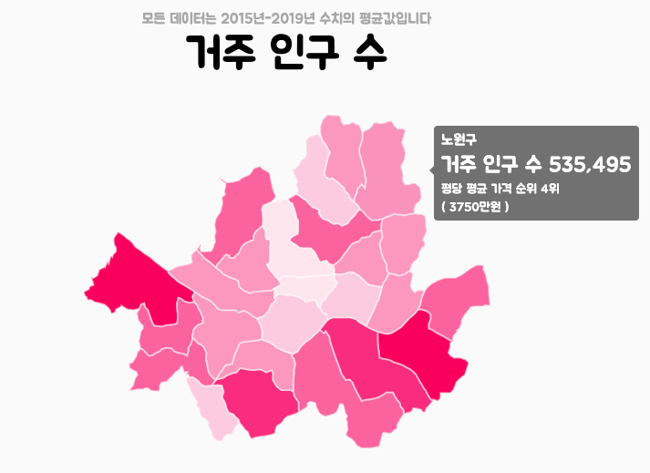

### b. Bar Chart

- Bar Chart 는 왼쪽부터 내림차순으로 정렬하여 직관적으로 볼 수 있도록 구현

    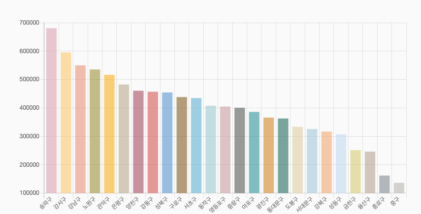

### c. Table

- Table은 각각의 행 기준으로 오름차순, 내림차순 정렬 가능 하도록 구현

    → 속성 이름을 클릭하면 원하는 기준으로 정렬 가능 ( 툴팁에 명시)

    → 테이블 각 Row간 간격 줄일 수 있도록 구현

    → 값들은 SVG 툴팁과 마찬가지로 1000단위 comma separate (react-number-format)

    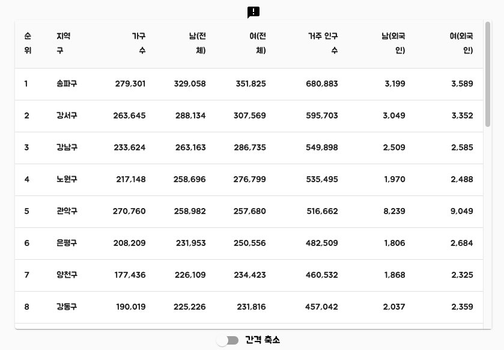

    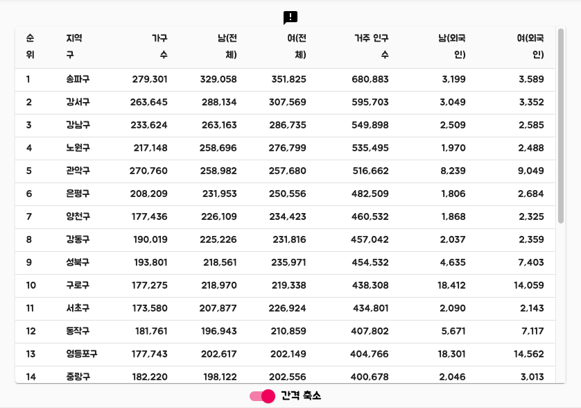

## 4) Radar Chart로 구별 속성값 비교

- Radar Chart는 구별로 전체적인 데이터를 한눈에 볼 수 있도록 구현

    → 여러 개의 구를 추가, 삭제 가능

    → 값은 전체 값들을 기준으로 상대적인 값으로 표현

    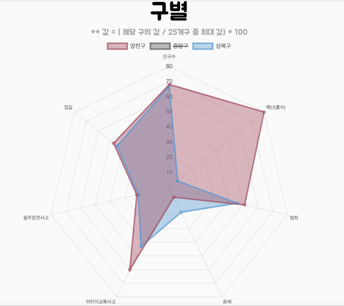

    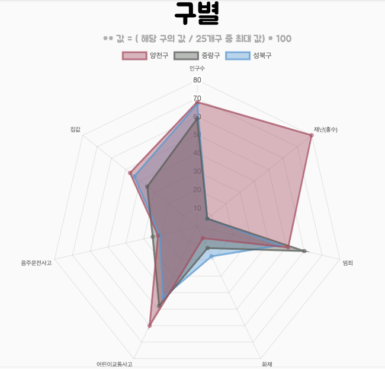

## 5) News

- 제목과 미리보기 텍스트로 직관적
- 클릭시 바로 해당 기사로 이동 할 수 있도록 구현 (새 페이지)


## 6) 최하단 고정 Footer

- Project GitHub repository link
- 출처 명시


## 7) For better User Experience

- Loading animation for async/await function

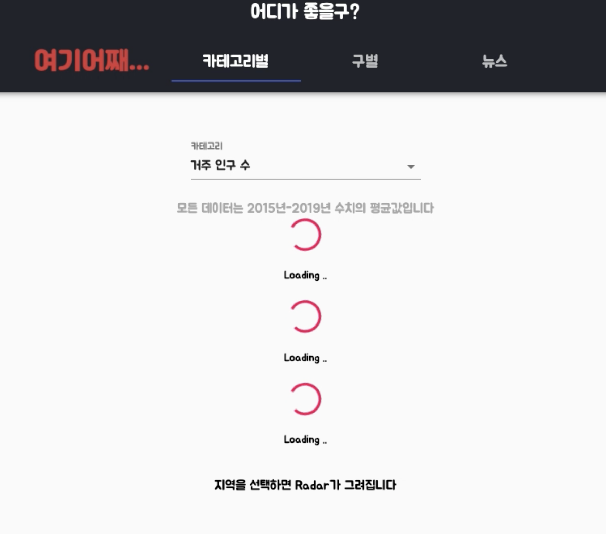

                                                                    **<Loading animation>**

- Error handling (HTTP status code ≥ 500) (roughly)

    Web Application 의 비정상 종료 없이 에러 메세지를 출력해서 에러 처리

    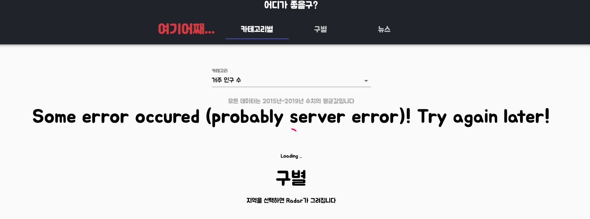

                                                                     **<Data Fetch Error>**

- 툴팁을 이용한 추가기능 설명

    

                                                                         **<Tooltip for User>**

## ** Deploy with gh-pages

.jpg)

- [https://multicampus-cloud-msa-safehome.github.io/safehome_frontend/](https://multicampus-cloud-msa-safehome.github.io/safehome_frontend/)
- package.json 파일에 gh-pages 배포를 위한 부분을 추가  ( `"homepage"`, `"predeploy"`, `"deploy"`)

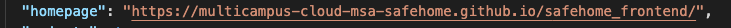

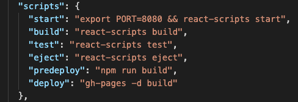

- (Mac OS X) 위의 설정이후 `yarn deploy`명령어를 통해 배포 가능

# 2. Back-end

# Django Rest Framework(DRF)


- DRF를 사용하여 Django에서 RESTful API 서버를 구축
- React와 연동하기 위한 serialize기능을 제공
- Queryset, Model Instance를 Json 형태로 렌더링

## 1) 전체 database 구성도

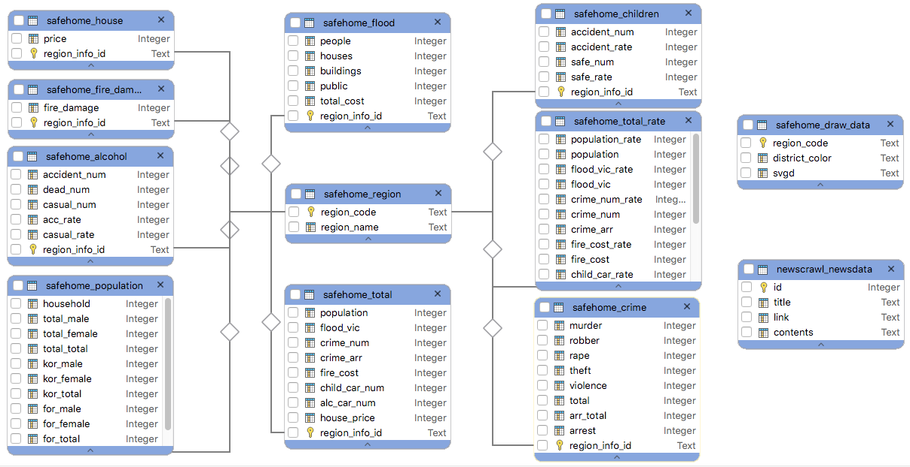

# MariaDB, SQLite, PostgreSQL


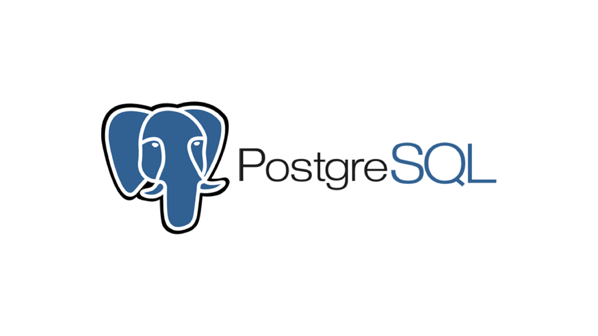

- 다소 산만하던 csv data를 pandas로 전처리
- MariaDB로 초기 데이터베이스 정규화 후 SQLite에서 Local작업
- 이후 heroku와의 연동을 위해 PostgreSQL로 이관

## 2) App 1 : safehome


- 공공데이터포털과 서울 열린데이터 광장에서 CSV 파일 다운로드
- Pandas를 이용하여 데이터 전처리 - 2015년부터 2019년까지 5개년 평균치 계산

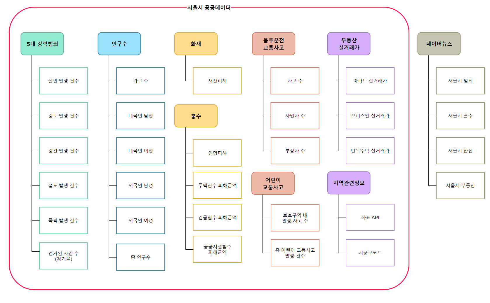

- DB 출처
1. 화재통계: [https://www.data.go.kr/data/3038724/fileData.do](https://www.data.go.kr/data/3038724/fileData.do)
2. 어린이 교통사고: [http://data.seoul.go.kr/dataList/570/S/2/datasetView.do](http://data.seoul.go.kr/dataList/570/S/2/datasetView.do)|
3. 음주운전 사고: [http://data.seoul.go.kr/dataList/10656/S/2/datasetView.do](http://data.seoul.go.kr/dataList/10656/S/2/datasetView.do)
4. 부동산 가격: [http://data.seoul.go.kr/dataList/OA-15548/S/1/datasetView.do](http://data.seoul.go.kr/dataList/OA-15548/S/1/datasetView.do)
5. 범죄율 현황: [https://www.data.go.kr/data/15054737/fileData.do](https://www.data.go.kr/data/15054737/fileData.do)
6. 인구수: [https://data.seoul.go.kr/dataList/419/S/2/datasetView.do](https://data.seoul.go.kr/dataList/419/S/2/datasetView.do)

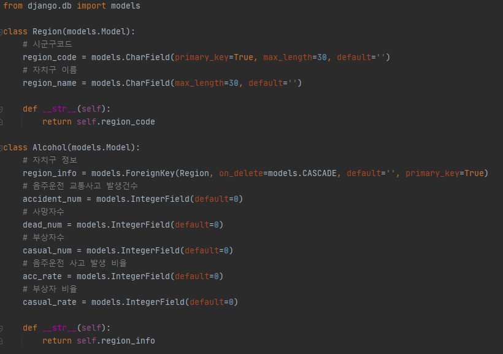

.png)

- 시군구코드, 좌표, 구별 지정색 등 지역정보는 primary key - foreign key로 통계데이터와 연결

## 3) App 2 : newscrawl

.jpg)

- 뉴스 데이터를 크롤링 하여 DB에 저장

    → 뉴스 데이터(NewsData)는 title, link, 일부 contents 를 포함

    → 네이버 뉴스([https://news.naver.com/](https://news.naver.com/)) 사용

    → 특정 검색어를 입력한 결과를 목적에 맞게 필터링하여 가져온다.

- python의 APSchduler 모듈을 사용하여  heroku에 뉴스 업데이트 예약

### a. NewData Model

```python
# newscrawl/models.py
from django.db import models

# 뉴스 데이터
class NewsData(models.Model):
    title = models.CharField(max_length=500) # 제목
    link = models.URLField() # url
    contents = models.TextField(max_length=500, default='') # 내용 일부

    def __str__(self):
        return self.title
```

### b. Web Crawling

- `BeautifulSoup, Request`사용
- 관련 검색어 5개를 지정하여 검색어 당 최근 기사 2개씩 크롤링
- database에 저장


### c.  Serialize Data

- 스크래핑한 데이터를 DRF서버에서 Serialize


### d. 크롤링 예약


                                                        <Scheduler process overview>

```python
#Procfile
release: python3 manage.py migrate
clock: python3 parser_scheduler.py # clock 기능을 사용
web: gunicorn mytest.wsgi
```

```python
# parser_scheduler.py
from apscheduler.schedulers.blocking import BlockingScheduler
import datetime
import pytz

import parser as pr

sched = BlockingScheduler()
local_tz = pytz.timezone('Asia/Seoul')

@sched.scheduled_job('interval', minutes=60*6) # 6시간
def timed_job():
    print('This job is run every six hour.')

    pr.del_save_data() # news update

sched.start()
```

- heroku에 `clock` 기능을 사용하여 일정 시간마다 `parser_scheduler.py`파일을 실행시킨다.
- 6시간 단위로 python의 `APScheduler`를 사용하여 크롤링 예약 후 database에 저장

## 5) 여기어째...  배포

## Heroku


- 무료로 이용할 수 있고, django 프로젝트를 쉽게 올릴 수 있는 클라우드 서비스
- heroku에서 제공하는 CLI와 Git을 이용해서 django프로젝트를 업로드하고 제어

### deploy with Heroku

1. `react-django-safehome` 웹앱을 생성하고 우리의 django project를 집어넣는다.
2. `git push heroku master` 명령을 통해 heroku에 배포한다.
3. heroku 홈페이지([https://dashboard.heroku.com/apps](https://dashboard.heroku.com/apps)) 에서 등록한 웹앱을 확인할 수 있다. 

    

4. 우리의 홈페이지 주소([https://django-react-safehome.herokuapp.com/](https://django-react-safehome.herokuapp.com/))로 접속하여 배포된 django app을 확인한다.

---

# 🏁 conclusion

## 개선점

1. 서비스 범위 확대

    → 현재 서울시 한정 제공하는 서비스를 전국단위로 지역 확대

2. 보다 세부적인 데이터 제공

    → 광범위한 구별 데이터에 비해 확실한 정보를 얻을 수 있는 동별 데이터 제공

3. 생활만족도 데이터 추가

    → 현재 제공되고 있는 범죄/재난 등 안전정보에서 나아가 편의/문화시설 데이터 제공

4. 커뮤니티 공간으로 확대

    → 회원가입, 로그인, 댓글 기능을 통한 실 거주자간 의견 공유

## 느낀점

**[황동윤]** 

- 독립적인 FE, BE로 개발을 진행해서 업무 분할이 체계적으로 이루어졌던 것이 좋았습니다.
- 배포 까지 해보면서 웹 어플리케이션을 개발할때 처음부터, 배포까지 고려한 설계가 중요함을 다시한번 느꼈습니다. 배포하는 과정이나, 배포를 한 이후에 개발했던 것과 다른 환경에서의 에러가 발생할 가능성이 있다는 것까지 생각해서 설계를 하는 것이 필요하다고 생각합니다.
- FE, BE 독립이라 소통이 중요하다는것. 양쪽의 naming convention 같은 부분들을 맞추는 부분에서 약간의 어려움 있었음.
- React로 SPA를 구현해보면서, 추가 적으로 앞으로 필요한 Redux, React router 같은 기술들에 대해 관심이 생겼고, 이번 프로젝트에서는 사용하지 못했지만, 사용하고 싶은 의욕이 샘솟는다.

**[강륜화]**

- 개발자 입장에서 겪는 인생 첫 프로젝트였는데 대학교를 다니면서 했던 전공/교양 과목 조별과제와는 기획부터 과정, 마무리까지 모든게 달라 새로운 관점, 새로운 입장으로 일해 볼 수 있어서 좋았다.
- 기록이 굉장히 중요하다는 사실을 알게 되었다. 다음 프로젝트를 할 때에는 설계부터 시작해서 프로젝트 진행상황, 각 조원들간의 협의과정 등 모든것을 지표화해야겠다.
- 초반에 서로를 너무 믿고(!) 각자 일을 하다가 결과물을 통합하는 과정에서 생긴 에러가 여럿 있었다. 간단하게는 변수명부터 크게는 이용하는 툴, 배포 여부까지 모든 것이 모두의 합의하에 이루어져야 하는데 초반에는 그런 것들을 고려하지 못했던 것이다. 단순히 아이디어를 내고 역할을 정했다고 해서 기획이 끝난 것이 아님을 알게 되었다. 기획에는 생각보다 긴 시간이 걸린다.
- 코로나로 인해 프로젝트 중간부터 서로 떨어져 일해야 했는데, 누군가 채찍질하거나 억지로 동기부여를 하지 않고 각자 스케줄대로, 마음대로였는데도 조원 모두가 맡은 일을 충실히 해서 멋진 결과물이 완성되었다. 누군가 새로운 의견을 냈을 때도 서로 함께 방법을 알아봐주는 적극적/능동적인 조원들을 만나 운이 좋았다고 생각한다. 감사합니다 여러분!

**[김유진]** 

- Front end와 Back end로 역할을 나누어 개발이 이루어져서 효율적 이었다.
- 배포를 처음 해 보면서 여러 사이트나 플랫폼을 알게 되었고, 수많은 오류를 해결하면서 계획 단계에서의 꼼꼼한 설계가 중요하다는 것을 알았다.
- 프로젝트 중간에 table을 만들거나 field name을 바꾸는 일이 자주 발생하였다. 처음 프로젝트 설계 부분에서 팀원이 다 함께 model과 database 설계를 꼼꼼히 하고 시작했으면 좋았을 것 같다.
- 뉴스를 크롤링 할때, 기존 db에 있던 것을 지우고 다시 새로운 것을 가져오는 방법을 사용하는데 db를 거치지 않고 바로 가지고 오는 방법을 사용하는 게 좋을 것 같다.
- django에서는 SQLite를 사용하고 있었는데, Hroku에서는 Postgres를 사용해야 해서 data를 dump하여 사용하였다.  두 DB를 완전히 연동하는 방법을 적용하거나 아예 DB를 Postgres나 mySQL로 통일하는 것이 좋겠다.

**[박진우]**

- 학부때는 공공데이터를 이용해서 프로젝트를 해보고 싶다는 생각만 하고 실제로 해보지는 못했는데 이번 프로젝트때 다양한 공공데이터를 응용해 볼 수 있어서 좋았습니다.
- DB에 데이터를 넣을때 실수를 해서 DB를 다시 만들어야 했었는데 문제가 생겨도 당황하지 않고 인내심을 가지고 해결해 나가는 중요성을 배울 수 있었습니다.
- 공공데이터 사이트를 끊임없이 서칭해 가면서 다양한 데이터 셋을 구성해볼 수 있어서 좋았습니다.

---
